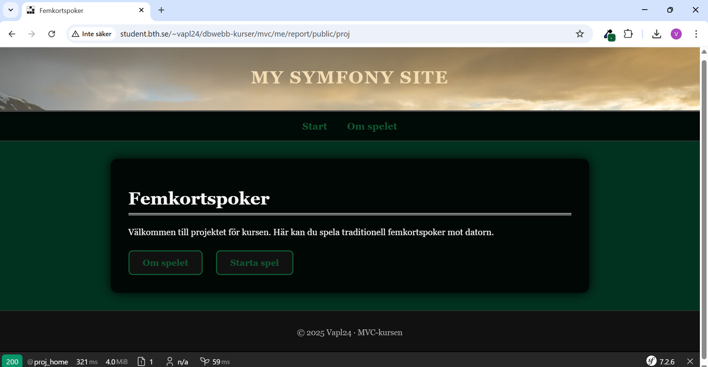
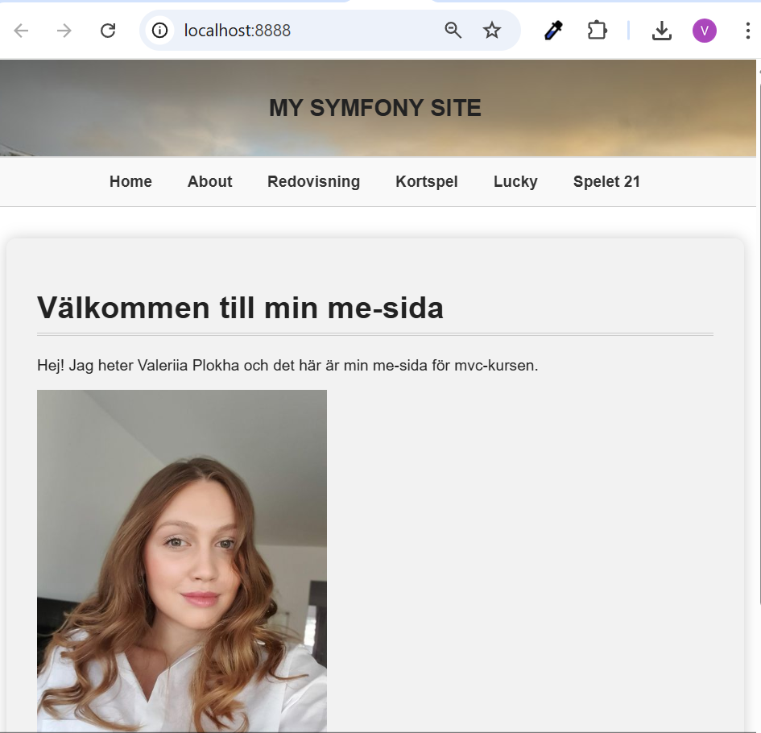

# Femkortspoker - Projekt i MVC-kursen

Detta är ett skolprojekt där man spelar traditionell femkortspoker mot datorn. Projektet är en del av kursen "Design och implementation av webbaserade applikationer med MVC".

## Funktioner

- Spelaren får 5 kort och kan byta upp till 3 gånger
- En datorhand skapas automatiskt
- Resultatet utvärderas efter sista bytet
- Spelaren kan satsa pengar varje runda
- Spelet avslutas när pengarna tar slut

## Kom igång

git clone https://github.com/Valle85/mvc-me.git
cd mvc/me/report
composer install
npm install
npm run build
symfony server:start

## 📚 Dokumentation & Analys

- [PHPDoc (lokalt)](phpdoc/index.html)  
- [PhpMetrics (lokalt)](metrics/index.html)  
- [Scrutinizer](https://scrutinizer-ci.com/g/Valle85/mvc-me/)

  
  

---

## 🧭 Om me-sidan

Min me-sida finns på `/`, med presentation, kursbeskrivning och redovisningar för varje kmom. Sidan är byggd i Symfony med layout, navbar, footer och JSON API.

## Navigering

- / – Presentation av mig själv  
- /about – Kursbeskrivning + länkar  
- /report – Redovisningstexter  
- /lucky – Slumpmässigt värde  
- /game – Startsida för kortspelet 21  
- /game/play – Spelets spelplan  
- /api – Översikt över JSON API  
- /api/quote – JSON med dagens citat  
- /api/game – JSON-status för kortspelet  
- /card – Meny för kortlek  
- /card/deck – Visar hela kortleken  
- /card/deck/shuffle – Blandar kortleken  
- /card/deck/draw – Drar ett kort  
- /card/deck/draw/:number – Drar valfritt antal kort  

# Kodkvalitet med PhpMetrics och Scrutinizer

Projektet innehåller en analys av kodkvalitet med hjälp av PhpMetrics och Scrutinizer. Fullständig rapport och analys finns på sidan /metrics.

## Verktyg 

- Scrutinizer
- PhpMetrics
- PHP
- Symfony

## Kommandon 

- composer phpunit
- composer phpmetrics
- composer lint
- composer phpdoc 