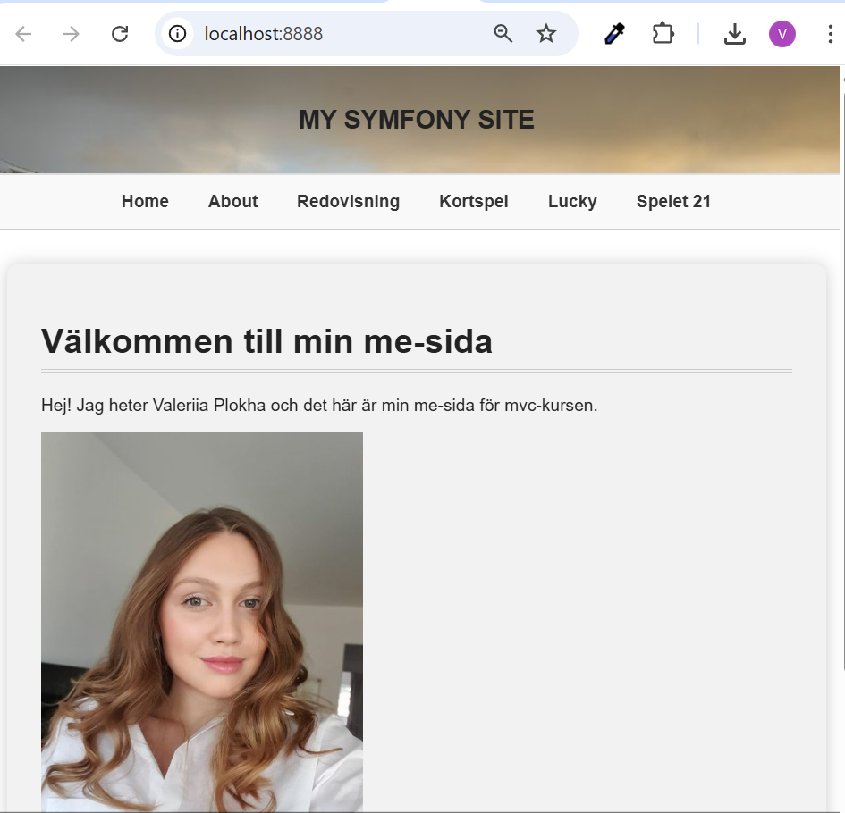

# Min me-sida för MVC-kursen

Detta är min me-sida för kursen *Objektorienterade webbteknologier (mvc)* på Blekinge Tekniska Högskola. Sidan är byggd med PHP-ramverket Symfony och följer strukturen med controllers, templates (Twig), JSON API och enhetlig layout med navbar, header och footer.

## Innehåll

- Presentation av mig själv
- Kursbeskrivning
- Redovisningstexter för alla kmom
- JSON API
- Sammanställning av alla JSON-API:er
- Enkel styling i `app.css`


### Klona repot

<!-- ```bash -->
git clone https://github.com/Valle85/mvc-me.git
cd mvc-me
composer install
Besök http://localhost:8000/

## Navigering

- / – Presentation av mig själv  
- /about – Kursbeskrivning + länkar  
- /report – Redovisningstexter  
- /lucky – Slumpmässigt värde  
- /game – Startsida för kortspelet 21  
- /game/play – Spelets spelplan  
- /api – Översikt över JSON API  
- /api/quote – JSON med dagens citat  
- /api/game – JSON-status för kortspelet  
- /card – Meny för kortlek  
- /card/deck – Visar hela kortleken  
- /card/deck/shuffle – Blandar kortleken  
- /card/deck/draw – Drar ett kort  
- /card/deck/draw/:number – Drar valfritt antal kort  

# Kodkvalitet med PhpMetrics och Scrutinizer

[](https://scrutinizer-ci.com/g/Valle85/mvc-me/)
[](https://scrutinizer-ci.com/g/Valle85/mvc-me/)
[](https://scrutinizer-ci.com/g/Valle85/mvc-me/)

Projektet innehåller en analys av kodkvalitet med hjälp av PhpMetrics och Scrutinizer. Fullständig rapport och analys finns på sidan /metrics.

## Verktyg 

- Scrutinizer
- PhpMetrics
- PHP
- Symfony

## Kommandon 

- composer phpunit
- composer phpmetrics
- composer lint
- composer phpdoc 